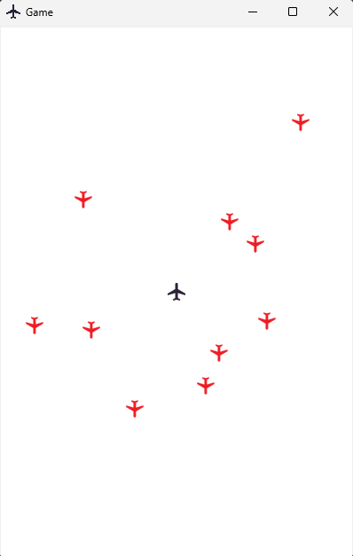
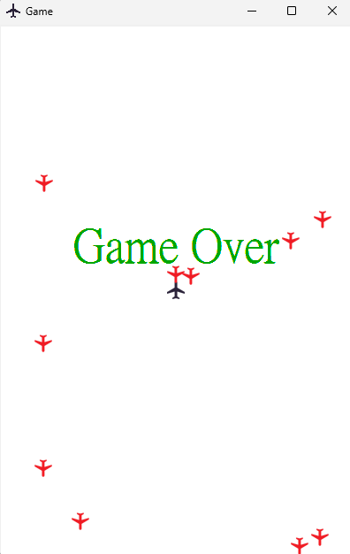

# requirements (run with python)
> If you use exe to execute the game, you don't need this step
```
pip install pillow
```
# download link

[clickme](https://github.com/qwerty121938/assignment/releases/download/v1.0/game.zip)
# demo

`game start`



`game over`


